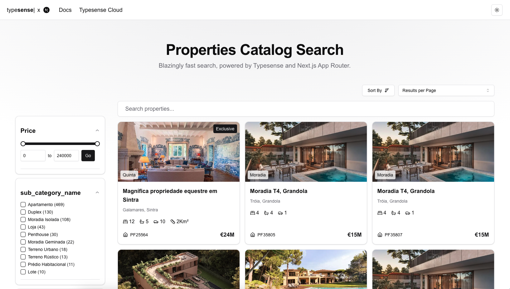
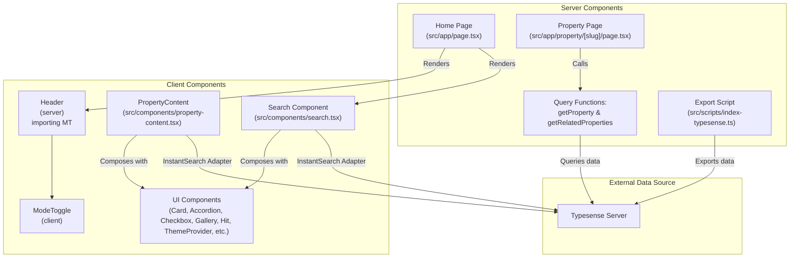

# 🎯 Porta da Frente Christie's Instant Search



A blazingly fast, server-side rendered search application for Porta da Frente Christie's website, powered by Typesense, Next.js App Router, and React InstantSearch.

## Features

- Server-side rendering using Next.js App Router for improved performance and SEO
- Instant, real-time search powered by Typesense with faceted filtering
- Dynamic filtering and sorting through custom React InstantSearch components
- Custom-styled UI built with shadcn/ui, Radix UI, and TailwindCSS
- Multilingual support for en-EN, pt-PT, and fr-FR
- Robust error handling and performance optimizations following industry best practices

## Installation

1. **Clone the repository:**

   ```bash
   git clone https://github.com/your-username/porta-da-frente-instantsearch.git
   cd porta-da-frente-instantsearch
   ```

2. **Install dependencies:**

   ```bash
   pnpm install
   ```

3. **Set up Typesense:**

   - Ensure you have Docker installed.
   - Adjust the Typesense configuration if needed in `src/lib/typesense.ts`.

4. **Index the data:**

   ```bash
   pnpm run index-typesense
   ```

5. **Start the development server:**

   ```bash
   pnpm run dev
   ```

## Usage

After starting the development server, open your browser and navigate to [http://localhost:3000](http://localhost:3000). You can then explore Porta da Frente Christie's property listings with instant search capabilities, dynamic filters, and faceted navigation.

## Configuration

The key configuration files are:

- **`src/lib/typesense.ts`**: Typesense client configuration.
- **`src/lib/schema.ts`**: Data schema definitions and attribute labels.
- **`docker-compose.yml`**: Typesense Docker configuration.
- **`tailwind.config.ts`**: TailwindCSS configuration.
- **`components.json`**: shadcn/ui configuration.

Feel free to modify these files to adjust search behavior, data structures, Typesense setup, or UI styling.

## Custom Components

This project makes extensive use of custom-styled React InstantSearch components (found in `src/components/instantsearch`) including:

- **Current Refinements**
- **Card Component for Hits**
- **Hits Per Page Selector**
- **Sort By Dropdown Menu**
- **Facet Menu for Dynamic Filters**
- **Range Menu with Slider/Form Elements**
- **Numeric Menu with Radio Groups**

Additional interactive UI elements (e.g., Card, Accordion, Checkbox) are implemented as client components (using `use client` directives), while all core data fetching and query logic is handled on the server side.

## Data Flow & Architecture

Below is the Mermaid diagram outlining the application's architecture, showing the separation between server and client components, as well as query handling to ensure that customer data remains secure:

<!-- BEGIN MERMAID DIAGRAM -->



<!-- END MERMAID DIAGRAM -->

## Contributing

Contributions are welcome! Please follow these steps:

1. Fork the repository.
2. Create a new branch:

   ```bash
   git checkout -b feature-branch-name
   ```

3. Make your changes and commit them:

   ```bash
   git commit -m "Add some feature"
   ```

4. Push to your branch:

   ```bash
   git push origin feature-branch-name
   ```

5. Submit a pull request.

## Credits

- **Dataset & Listings**: Property data provided by Porta da Frente Christie's.
- **Search Engine**: [Typesense](https://typesense.org/)
- **Framework**: [Next.js](https://nextjs.org/) with the App Router.
- **Search UI**: [React InstantSearch](https://www.algolia.com/doc/guides/building-search-ui/what-is-instantsearch/react/)
- **UI Libraries**: [ShadcnUI](https://ui.shadcn.com/) and [Radix UI](https://www.radix-ui.com/)
- **Styling**: [Tailwind CSS](https://tailwindcss.com/)
- **Icons**: [Lucide React](https://lucide.dev/)
- **Validation**: [Zod](https://zod.dev/)

## Acknowledgements

- Special thanks to the teams behind Typesense, Next.js, and the UI libraries that made this project possible.
- We appreciate the contributions from the open-source community and welcome new ideas and improvements.
